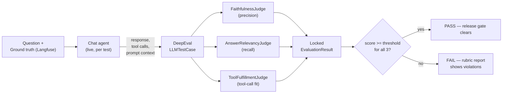

# llm-evaluation-harness

Production LLM evaluation harness: a 3-judge LLM-as-a-judge scoring system (faithfulness, precision, recall) built on Python, pytest, and [DeepEval](https://github.com/confident-ai/deepeval). Runs 320+ automated evaluations per release as a mandatory go/no-go gate for a legal-tech conversational agent.

Instead of one general-purpose "rate this response" judge, the harness runs **three narrow, locked-rubric judges** in parallel. Each one scores a single dimension of response quality against a fixed, versioned scoring contract. Locking the rubric (exact output schema, exact violation-prefix vocabulary, exact scoring formula) keeps judge output comparable release over release instead of drifting every time a prompt is tweaked.

## How it works



| Judge | Metric | Threshold | Question it answers |
|---|---|---|---|
| `FaithfulnessJudge` | `faithfulness` (precision) | 0.90 | Is every factual claim in the response traceable to a source (tool results or injected prompt context)? |
| `AnswerRelevancyJudge` | `answer_relevancy` (recall) | 0.85 | Does the response cover every fact the ground truth says it must, under paraphrase tolerance? |
| `ToolFulfillmentJudge` | `tool_fulfillment` | 0.80 | Did the agent call the right tools? Not too few, and not wastefully many, given what was already in context. |

Every judge emits the same locked `EvaluationResult` shape (`graph/judges/schemas.py`):

```python
class EvaluationResult(BaseModel):
    metric: MetricName             # "faithfulness" | "answer_relevancy" | "tool_fulfillment"
    score: float                   # 0.0-1.0
    violating_sentences: list[str] # e.g. "[UNGROUNDED] ...", "[MISSING] ...", "[WRONG_TOOL] ..."
    rationale: str                 # hard-capped at 2 sentences
```

A closed, inline-prefix vocabulary (`UNGROUNDED`, `MISSING`, `WRONG`, `FORBIDDEN`, `WRONG_TOOL`, `MISSING_TOOL`, `OFF_TOPIC`) means violations are machine-parseable. The rubric report and any downstream tooling can grep them instead of re-parsing free text.

## Repo layout

```
graph/judges/                  Locked-rubric LLM judges (the evaluation engine)
├── base.py                    BaseJudge / LockedRubricJudge — prompt+schema → structured LLM call
├── faithfulness_judge.py      Precision: claims must trace to tool_results or prompt_context
├── answer_relevancy_judge.py  Recall: response must cover every ground-truth item
├── tool_fulfillment_judge.py  Tool-call pattern vs. question intent
├── golden_answer_judge.py     4-turn conversational judge (decompose → check → correlate → verdict)
├── chunk_relevance_judge.py   Filters retrieved chunks before they reach the agent
├── prompts.py                 The locked rubric prompts themselves
├── schemas.py                 EvaluationResult + the closed violation vocabulary
└── utils.py                   Multi-channel source formatting for the Faithfulness judge

tests/llm_evals/               DeepEval integration: wraps the judges as BaseMetric adapters
├── metrics/                   FaithfulnessMetric, AnswerRelevancyMetric, ToolFulfillmentMetric
├── reporters/rubric_report.py Markdown report writer (see sample below)
├── conftest.py                Pulls ground truth from Langfuse Datasets, runs the live agent
└── test_chat_evals.py         The actual `assert_test(...)` gate pytest runs per release

tests/unit/llm_evals/          Pure-logic unit tests for the adapters/reporter (no live agent, no LLM calls)
```

## Test output

The unit suite (`tests/unit/llm_evals/`) exercises the DeepEval metric adapters and the report writer with everything mocked at the judge boundary. There are no live LLM calls, no Langfuse, and no agent involved. This is a real local run of this exact code:

```
$ python -m pytest tests/unit/llm_evals/ -v
======================== test session starts ========================
platform linux -- Python 3.10.12, pytest-9.1.1, pluggy-1.6.0
plugins: asyncio-1.4.0, deepeval-4.2.0
asyncio: mode=strict
collected 50 items

tests/unit/llm_evals/test_conftest_helpers.py::TestBuildTestCase::test_returns_llm_test_case PASSED
tests/unit/llm_evals/test_conftest_helpers.py::TestBuildTestCase::test_input_from_langfuse PASSED
tests/unit/llm_evals/test_conftest_helpers.py::TestBuildTestCase::test_actual_output_from_agent PASSED
tests/unit/llm_evals/test_conftest_helpers.py::TestBuildTestCase::test_expected_output_from_narrative PASSED
tests/unit/llm_evals/test_conftest_helpers.py::TestBuildTestCase::test_retrieval_context_from_expected_context PASSED
tests/unit/llm_evals/test_conftest_helpers.py::TestBuildTestCase::test_metadata_carries_tool_results PASSED
tests/unit/llm_evals/test_conftest_helpers.py::TestBuildTestCase::test_metadata_carries_prompt_context PASSED
tests/unit/llm_evals/test_conftest_helpers.py::TestBuildTestCase::test_metadata_carries_gt_fields PASSED
tests/unit/llm_evals/test_conftest_helpers.py::TestBuildTestCase::test_metadata_carries_item_id PASSED
tests/unit/llm_evals/test_conftest_helpers.py::TestBuildTestCase::test_handles_empty_agent_response PASSED
tests/unit/llm_evals/test_conftest_helpers.py::TestParseExpectedOutput::test_dict_input PASSED
tests/unit/llm_evals/test_conftest_helpers.py::TestParseExpectedOutput::test_none_input PASSED
tests/unit/llm_evals/test_conftest_helpers.py::TestParseExpectedOutput::test_empty_dict PASSED
tests/unit/llm_evals/test_conftest_helpers.py::TestGetAllFixtureNames::test_returns_list PASSED
tests/unit/llm_evals/test_conftest_helpers.py::TestGetAllFixtureNames::test_includes_known_fixtures PASSED
tests/unit/llm_evals/test_conftest_helpers.py::TestGetAllFixtureNames::test_includes_crm_fixtures PASSED
tests/unit/llm_evals/test_metrics.py::TestLockedRubricMetricBase::test_inherits_base_metric PASSED
tests/unit/llm_evals/test_metrics.py::TestLockedRubricMetricBase::test_inherits_locked_rubric_metric PASSED
tests/unit/llm_evals/test_metrics.py::TestLockedRubricMetricBase::test_initial_state PASSED
tests/unit/llm_evals/test_metrics.py::TestLockedRubricMetricBase::test_is_successful_none_score PASSED
tests/unit/llm_evals/test_metrics.py::TestLockedRubricMetricBase::test_is_successful_passing PASSED
tests/unit/llm_evals/test_metrics.py::TestLockedRubricMetricBase::test_is_successful_failing PASSED
tests/unit/llm_evals/test_metrics.py::TestFaithfulnessMetric::test_metric_name PASSED
tests/unit/llm_evals/test_metrics.py::TestFaithfulnessMetric::test_default_threshold PASSED
tests/unit/llm_evals/test_metrics.py::TestFaithfulnessMetric::test_custom_threshold PASSED
tests/unit/llm_evals/test_metrics.py::TestFaithfulnessMetric::test_a_measure_passing PASSED
tests/unit/llm_evals/test_metrics.py::TestFaithfulnessMetric::test_a_measure_failing PASSED
tests/unit/llm_evals/test_metrics.py::TestFaithfulnessMetric::test_evaluation_result_extracted PASSED
tests/unit/llm_evals/test_metrics.py::TestAnswerRelevancyMetric::test_metric_name PASSED
tests/unit/llm_evals/test_metrics.py::TestAnswerRelevancyMetric::test_default_threshold PASSED
tests/unit/llm_evals/test_metrics.py::TestAnswerRelevancyMetric::test_a_measure_passes_correct_kwargs PASSED
tests/unit/llm_evals/test_metrics.py::TestToolFulfillmentMetric::test_metric_name PASSED
tests/unit/llm_evals/test_metrics.py::TestToolFulfillmentMetric::test_default_threshold PASSED
tests/unit/llm_evals/test_metrics.py::TestToolFulfillmentMetric::test_a_measure_passes_correct_kwargs PASSED
tests/unit/llm_evals/test_metrics.py::TestFormatGroundTruth::test_full_metadata PASSED
tests/unit/llm_evals/test_metrics.py::TestFormatGroundTruth::test_empty_metadata PASSED
tests/unit/llm_evals/test_metrics.py::TestFormatGroundTruth::test_partial_metadata PASSED
tests/unit/llm_evals/test_reporter.py::TestQuestionResult::test_initial_state PASSED
tests/unit/llm_evals/test_reporter.py::TestQuestionResult::test_set_metric_passing PASSED
tests/unit/llm_evals/test_reporter.py::TestQuestionResult::test_set_metric_failing PASSED
tests/unit/llm_evals/test_reporter.py::TestRubricReportWriter::test_empty_report PASSED
tests/unit/llm_evals/test_reporter.py::TestRubricReportWriter::test_report_contains_all_metrics PASSED
tests/unit/llm_evals/test_reporter.py::TestRubricReportWriter::test_report_summary_pass_status PASSED
tests/unit/llm_evals/test_reporter.py::TestRubricReportWriter::test_report_summary_fail_status PASSED
tests/unit/llm_evals/test_reporter.py::TestRubricReportWriter::test_per_question_section PASSED
tests/unit/llm_evals/test_reporter.py::TestRubricReportWriter::test_violations_shown PASSED
tests/unit/llm_evals/test_reporter.py::TestRubricReportWriter::test_rationale_shown PASSED
tests/unit/llm_evals/test_reporter.py::TestRubricReportWriter::test_write_creates_file PASSED
tests/unit/llm_evals/test_reporter.py::TestRubricReportWriter::test_metric_order_is_locked PASSED
tests/unit/llm_evals/test_reporter.py::TestRubricReportWriter::test_thresholds_match_judges PASSED

========================= 50 passed in 0.07s =========================
```

*(Ran locally against this exact code. A handful of internal-only modules this export doesn't include needed minimal stubs purely to satisfy imports: Django settings, the Langfuse client, and the live-agent harness. No production infrastructure, credentials, or data involved. The live-agent, live-LLM suite in `tests/llm_evals/` needs the real internal deps and isn't runnable standalone.)*

## Sample rubric report

`RubricReportWriter` (`tests/llm_evals/reporters/rubric_report.py`) writes one Markdown report per evaluation run. This one was generated by that exact class against two synthetic questions. One is a clean pass, and the other has a deliberately introduced ungrounded claim and a missing ground-truth item, to show what a failure looks like:

```markdown
# DeepEval Run Report - john_smith

**Generated:** 2026-08-31 16:16:19 UTC
**Questions evaluated:** 2
**Duration:** 0.0s

## Summary

| Metric | Avg Score | Threshold | Pass Rate | Status |
|--------|-----------|-----------|-----------|--------|
| faithfulness | 0.7750 | 0.90 | 1/2 | FAIL |
| answer_relevancy | 0.8350 | 0.85 | 1/2 | FAIL |
| tool_fulfillment | 1.0000 | 0.80 | 2/2 | PASS |

## Per-Question Results

### medical_bills_total: What are the total medical bills?

- **faithfulness**: 0.9500 [PASS] | violations: [none]
  - rationale: All claims are grounded in tool results and prompt context.
- **answer_relevancy**: 1.0000 [PASS] | violations: [none]
  - rationale: Response conveys the GT total and provider name.
- **tool_fulfillment**: 1.0000 [PASS] | violations: [none]
  - rationale: Called get_entity_data, matching the medical-bills domain.

### accident_date_location: When did the accident occur and where?

- **faithfulness**: 0.6000 [FAIL] | violations: [[UNGROUNDED] the intersection of Elm and 4th (no source match)]
  - rationale: Location claim has no matching source; date claim is grounded.
- **answer_relevancy**: 0.6700 [FAIL] | violations: [[MISSING] I-25]
  - rationale: Date conveyed correctly; expected highway reference is missing.
- **tool_fulfillment**: 1.0000 [PASS] | violations: [none]
  - rationale: No tools needed; answer was available in prompt context.
```

Note the release-gate math. A metric's status is driven off the **average score across all questions in the dataset**, not a per-question pass/fail. One bad answer degrades the number without automatically failing the run, but a systematic issue drags the average below threshold and blocks the release.

## What's in this repo

This is a **code-only export**. It includes the evaluation prompts, judge classes, DeepEval adapters, and their unit tests. It does not include:

- The chat agent, CRM/graph integration, or any other application code the judges evaluate
- Ground-truth datasets. These live in Langfuse and are fetched at runtime via `LangfuseDatasetClient`.
- Any case data, PII, or credentials. Verified clean before publishing.

## Stack

Python · pytest · pytest-asyncio · [DeepEval](https://github.com/confident-ai/deepeval) · [Pydantic](https://docs.pydantic.dev/) · OpenAI structured outputs

## License

[MIT](https://opensource.org/licenses/MIT)


## About the Creator

Built out of curiosity for how far a locked, narrow evaluation rubric can push consistency in LLM-as-a-judge systems.

- LinkedIn: https://www.linkedin.com/in/jayme-hall/
- GitHub: https://github.com/jaymehall/
- Website: [https://jaymehall-dev.netlify.app/](https://jaymehall-dev.netlify.app/)
